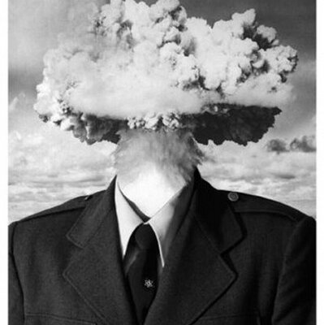
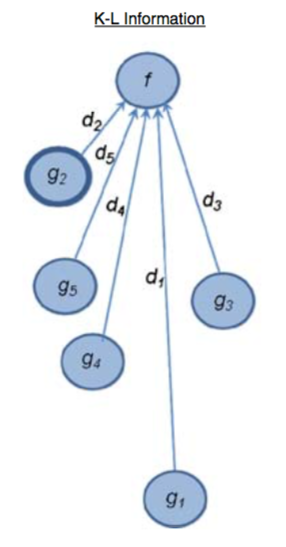
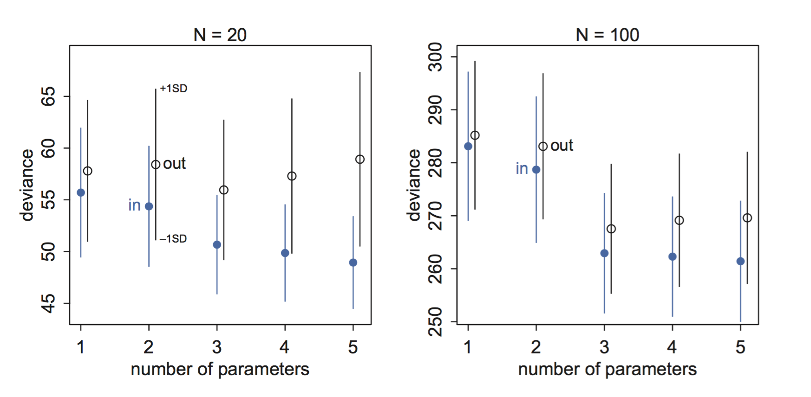
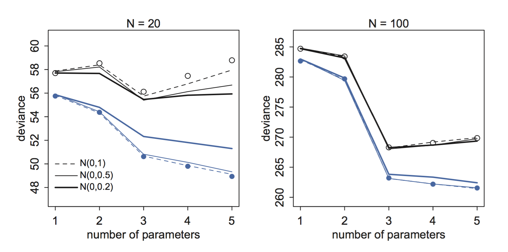
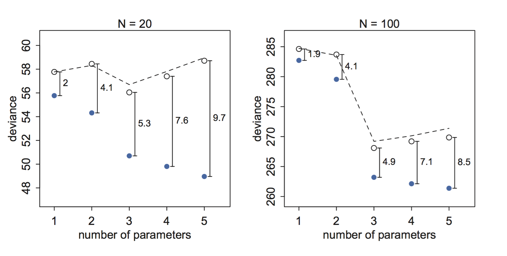

Model comparison
========================================================
author: Ladislas Nalborczyk
date: Univ. Grenoble Alpes, CNRS, LPNC (France) • Ghent University (Belgium)
autosize: true
transition: none
width: 1600
height: 1000
css: css-file.css

Hypothesis testing
========================================================
incremental: true
type: lineheight


<!-- For syntax highlighting -->
<link rel="stylesheet" href="github.css">

Let's say we are interested in height differences between women and men...


```r
x <- rnorm(100, 175, 10) # 100 men heights
y <- rnorm(100, 170, 10) # 100 women heights
```


```r
t.test(x, y)
```

```

	Welch Two Sample t-test

data:  x and y
t = 3.1094, df = 193.84, p-value = 0.002157
alternative hypothesis: true difference in means is not equal to 0
95 percent confidence interval:
 1.762509 7.876731
sample estimates:
mean of x mean of y 
 175.5725  170.7529 
```

Null hypothesis Significance Testing (NHST)
========================================================
incremental: true
type: lineheight

We are going to simulate t-values computed on samples generated under the assumption of no difference between women and men (the null hypothesis H0).


```r
nSims <- 1e4 # number of simulations
t <- rep(NA, nSims) # initialises t vector

for (i in 1:nSims) {
    
    xx <- rnorm(100, 170, 10)
    yy <- rnorm(100, 170, 10)
    t[i] <- t.test(xx, yy)$statistic
    
}
```


```r
t <- replicate(nSims, t.test(rnorm(100, 170, 10), rnorm(100, 170, 10) )$statistic)
```

Null hypothesis Significance Testing (NHST)
========================================================
incremental: false
type: lineheight


```r
data.frame(t = t) %>%
    ggplot(aes(x = t) ) +
    geom_histogram() +
    theme_bw(base_size = 20)
```


Null hypothesis Significance Testing (NHST)
========================================================
incremental: false
type: lineheight


```r
data.frame(x = c(-5, 5) ) %>%
    ggplot(aes(x = x) ) +
    stat_function(fun = dt, args = list(df = t.test(x, y)$parameter), size = 1.5) +
    theme_bw(base_size = 20)
```


Null hypothesis Significance Testing (NHST)
========================================================
incremental: false
type: lineheight


```r
alpha <- 0.05
abs(qt(alpha / 2, df = t.test(x, y)$parameter) ) # two-sided critical t-value
```

```
[1] 1.972018
```


P-values
========================================================
incremental: true
type: lineheight

A p-value is simply a tail area (an integral), under the distribution of test statistics under the null hypothesis... It gives the probability of observing the data we observed (or more extreme data), **given that the null hypothesis is true**.

$$p[\mathbf{t}(\mathbf{x}^{\text{rep}}|H_{0}) \geq t(x)]$$


```r
t.test(x, y)$p.value
```

```
[1] 0.00208192
```

```r
2 * integrate(dt, abs(t.test(x, y)$statistic), Inf, df = t.test(x, y)$parameter)$value
```

```
[1] 0.002081921
```

Model comparison
========================================================
incremental: true
type: lineheight

Two common problems in statistical learning: overfitting and underfitting... how to avoid it ?

- Using regularisation and regularising priors. The aim is to constrain the learning, to constrain the influence of the incoming data on the inference.
- Using cross-validation or information criteria (e.g., AIC, WAIC)

<br>

$$R^{2} = \frac{\text{var}(\text{outcome}) - \text{var}(\text{residuals})}{\text{var}(\text{outcome})} =
1 - \frac{\text{var}(\text{residuals})}{\text{var}(\text{outcome})}$$

Overfitting
========================================================
incremental: false
type: lineheight


```r
ppnames <- c("afarensis","africanus","habilis","boisei",
        "rudolfensis","ergaster","sapiens")
brainvolcc <- c(438, 452, 612, 521, 752, 871, 1350)
masskg <- c(37.0, 35.5, 34.5, 41.5, 55.5, 61.0, 53.5)

d <- data.frame(species = ppnames, brain = brainvolcc, mass = masskg)

d %>%
    ggplot(aes(x = mass, y = brain, label = species) ) +
    geom_point() +
    ggrepel::geom_label_repel(hjust = 0, nudge_y = 50, size = 5) +
    theme_bw(base_size = 20) + xlim(30, 70)
```


Overfitting
========================================================
incremental: true
type: lineheight


```r
mod1.1 <- lm(brain ~ mass, data = d)
(var(d$brain) - var(residuals(mod1.1) ) ) / var(d$brain)
```

```
[1] 0.490158
```

```r
mod1.2 <- lm(brain ~ mass + I(mass^2), data = d)
(var(d$brain) - var(residuals(mod1.2) ) ) / var(d$brain)
```

```
[1] 0.5359967
```

```r
mod1.3 <- lm(brain ~ mass + I(mass^2) + I(mass^3), data = d)
(var(d$brain) - var(residuals(mod1.3) ) ) / var(d$brain)
```

```
[1] 0.6797736
```


Overfitting
========================================================
incremental: false
type: lineheight


Underfitting
========================================================
incremental: false
type: lineheight

$$\begin{align}
v_{i} &\sim \mathrm{Normal}(\mu_{i}, \sigma) \\
\mu_{i} &= \alpha \\
\end{align}$$


```r
mod1.7 <- lm(brain ~ 1, data = d)
```


Information theory
========================================================
incremental: true
type: lineheight

We would like to mesure the *distance* between our model and the *full reality* (i.e., the data generating process)... but we will first make a detour via information theory.

We can define **information** as the amount of reduction in uncertainty. When we learn a new outcome (a new observation), how much does it reduce our uncertainty ?

We need a way a measuring uncertainty. For $n$ possible events, with each event $i$ having a probability $p_{i}$, a measure of uncertainty is given by:

$$H(p) = - \text{E log}(p_{i}) = - \sum_{i=1}^{n}p_{i} \text{log}(p_{i})$$

In other words, *the uncertainty contained in a probability distribution is the average log-probability of an event*.

Uncertainty
========================================================
incremental: true
type: lineheight

Let's take as an example weather forecasting. Let's say the probability of having rain or sun on an average day in Ghent is, respectively, $p_{1} = 0.7$ and $p_{2} = 0.3$.

Alors, $H(p) = - (p_{1} \text{log}(p_{1}) + p_{2} \text{log}(p_{2}) ) \approx 0.61$.


```r
p <- c(0.7, 0.3)
- sum(p * log(p) )
```

```
[1] 0.6108643
```

Now let's consider the weather in Abu Dabi. There, the probability of having rain or sun is of $p_{1} = 0.01$ and $p_{2} = 0.99$.


```r
p <- c(0.01, 0.99)
- sum(p * log(p) )
```

```
[1] 0.05600153
```

Divergence
========================================================
incremental: true
type: lineheight

We now have a way of quantifying uncertainty. How does it help us to measure the distance between our model and the full reality ?

**Divergence**: uncertainty added by using a probability distribution to describe... another probability distribution ([Kullback-Leibler divergence](https://fr.wikipedia.org/wiki/Divergence_de_Kullback-Leibler)).

$$D_{KL}(p,q) = \sum_{i} p_{i}\big(\text{log}(p_{i}) - \text{log}(q_{i})\big) = \sum_{i} p_{i} \text{log}\bigg(\frac{p_{i}}{q_{i}}\bigg)$$

Divergence
========================================================
incremental: true
type: lineheight

$$D_{KL}(p,q) = \sum_{i} p_{i}\big(\text{log}(p_{i}) - \text{log}(q_{i})\big) = \sum_{i} p_{i} \text{log}\bigg(\frac{p_{i}}{q_{i}}\bigg)$$

As an example, let's say that the *true* probability of the events *rain* and *sun* is $p_{1} = 0.3$ and $p_{2} = 0.7$. What uncertainty do we add if we think that the probabilities are rather $q_{1} = 0.25$ and $q_{2} = 0.75$ ?


```r
p <- c(0.3, 0.7)
q <- c(0.25, 0.75)

sum(p * log(p / q) )
```

```
[1] 0.006401457
```

```r
sum(q * log(q / p) )
```

```
[1] 0.006164264
```

Cross entropy and Divergence
========================================================
incremental: true
type: lineheight

**Cross entropy**: $H(p,q) = \sum_{i} p_{i} \log (q_{i})$


```r
sum(p * (log(q) ) )
```

The **Divergence** can be defined as the additional entropy added when using $q$ to describe $p$.

$$
\begin{align}
D_{KL}(p,q) &= H(p,q) - H(p) \\
&= - \sum_{i} p_{i} \log(q_{i}) - \big( - \sum_{i} p_{i} \log(p_{i}) \big) \\
&= - \sum_{i} p_{i} \big(\log(q_{i}) - \log(p_{i}) \big) \\ 
\end{align}
$$


```r
- sum (p * (log(q) - log(p) ) )
```

```
[1] 0.006401457
```

Toward the deviance...
========================================================
incremental: false
type: lineheight

Fine. But we do not know the full reality in real life...

We do not need to know it ! When comparing two models (two distributions) $q$ and $r$, to approximate $p$, we can compare their divergences. Thus, $\text{E} \ \text{log}(p_{i})$ will be the same quantity for both divergences... !

<div align = "center" style="border:none;">

</div>

Toward the deviance...
========================================================
incremental: false
type: lineheight

We can use $\text{E} \ \text{log}(q_{i})$ and $\text{E} \ \text{log}(r_{i})$ as estimations of the relative distance between each model end the target distribution (the full reality). We only need the avearge log-probability of the model.

As we do not know the target distribution, we can not interpret these values in absolute terms. We are interested in the relative distances: $\text{E} \ \text{log}(q_{i}) - \text{E} \ \text{log}(r_{i})$.

<div align = "center" style="border:none;">

</div>

Deviance
========================================================
incremental: true
type: lineheight

To approximate $\text{E} \ \log(p_{i})$, we use the [deviance](https://en.wikipedia.org/wiki/Deviance_%28statistics%29) of a model, whic measures "how bad" is a model to explain some data.

$$D(q) = -2 \sum_{i} \log(q_{i})$$

where $i$ indexes observations and $q_{i}$ is the *likelihood* of each observation.


```r
d$mass.s <- scale(d$mass)
mod1.8 <- lm(brain ~ mass.s, data = d)

-2 * logLik(mod1.8) # computing the deviance
```

```
'log Lik.' 94.92499 (df=3)
```

Deviance
========================================================
incremental: true
type: lineheight


```r
# extracting model's coefficients

alpha <- coef(mod1.8)[1]
beta <- coef(mod1.8)[2]

# computing the log-likelihood

ll <- sum(dnorm(
        d$brain,
        mean = alpha + beta * d$mass.,
        sd = sd(residuals(mod1.8) ),
        log = TRUE) )

# computing the deviance

(-2) * ll
```

```
[1] 95.00404
```

In-sample and out-of-sample
========================================================
incremental: true
type: lineheight

The deviance has the same problem as the $R^{2}$, when it is computed on the training dataset (the observed data). In this situation, we call it **in-sample deviance**.

If we are interested in the predictive abilities of a model, we can compute the deviance of the model on a new dataset (the test dataset)... We call this the **out-of-sample deviance**. It answers the question: how bad is the model to predict future data ?

Let's say we have a sample of size $N$, that we call the *training dataset*. We can compute the deviance of a model on this sample ($D_{train}$ or $D_{in}$). If we then acquire a new sample of size $N$ issued from the same data generating process (we call it the *test dataset*), we can compute the deviance of the model on this new dataset, by using the values of the parameters we estimated with the training dataset (we call this $D_{test}$ or $D_{out}$).

In sample and out of sample deviance
========================================================
incremental: true
type: lineheight

$$
\begin{align}
y_{i} &\sim \mathrm{Normal}(\mu_{i},1) \\
\mu_{i} &= (0.15) x_{1,i} - (0.4) x_{2,i} \\
\end{align}
$$

<div align = "center" style="border:none;">

</div>

On a réalisé ce processus 10.000 fois pour cinq modèles de régression linéaire de complexité croissante. Les points bleus représentent la déviance calculée sur l'échantillon d'apprentissage et les points noirs la déviance calculée sur l'échantillon de test.

Regularisation
========================================================
incremental: false
type: lineheight

Une autre manière de lutter contre l'*overfitting* est d'utiliser des priors *sceptiques* qui vont venir ralentir l'apprentissage réalisé sur les données (i.e., accorder plus de poids au prior).


Regularisation
========================================================
incremental: true
type: lineheight

<div align = "center" style="border:none;">

</div>

Comment décider de la précision du prior ? Est-ce que le prior est "assez" régularisateur ou pas ?

On peut diviser le jeu de données en deux parties (*training* et *test*) afin de choisir le prior qui produit la déviance *out-of-sample* la plus faible. On appelle cette stratégie la **cross-validation**.

Information criteria
========================================================
incremental: false
type: lineheight

<div align = "center" style="border:none;">

</div>

On mesure ici la différence entre la déviance *in-sample* (en bleu) et la déviance *out-of-sample* (en noir). On remarque que la déviance *out-of-sample* est presque exactement égale à la déviance *in-sample*, plus deux fois le nombre de prédicteurs du modèle...

Akaike information criterion
========================================================
incremental: true
type: lineheight

L'AIC fournit une approximation de la déviance *out of sample*:

$$\text{AIC} = D_{train} + 2p$$

où $p$ est le nombre de paramètres libres (i.e., à estimer) dans le modèle. L'AIC donne donc une approximation des capacités de **prédiction** du modèle.

NB: l'AIC fonctionne bien uniquement quand le nombre d'observations $N$ est largement supérieur au nombre de paramètres $p$. Dans le cas contraire, il existe des corrections qui permettent de pallier à ce problème (voir Burnham & Anderson, 2002; 2004).

Akaike weights and evidence ratios
========================================================
incremental: true
type: lineheight

...

<script src="https://ajax.googleapis.com/ajax/libs/jquery/3.1.1/jquery.min.js"></script>
<script>

for(i=0;i<$("section").length;i++) {
if(i==0) continue
$("section").eq(i).append("<p style='font-size:xx-large;position:fixed;right:200px;bottom:50px;'>" + i + "</p>")
}

</script>
