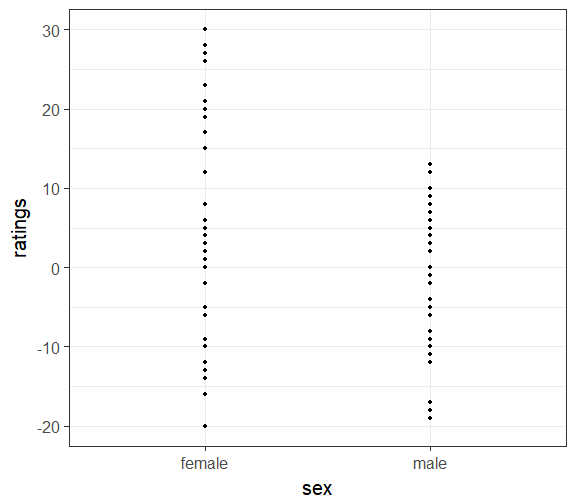

Model comparison approach to ANOVA
========================================================
author: Ivan Grahek
date: Ghent University (Belgium)
autosize: true
transition: none
width: 1600
height: 1000
css: css-file.css

Contents
========================================================
incremental: true
type: lineheight

- Model comparison approach to data analysis
- Regression 101 (2 continuous variables)
- Regression with categorical variables
- Model comparison approach to ANOVA


The standard way: IF-THEN cookbook
========================================================
incremental: true
type: lineheight

<div align = "center" style="float: bottom;">

</div>

The model comparison approach: Regressions all the way down
========================================================
incremental: true
type: lineheight

<div align = "center" style="float: bottom;">

</div>

The model comparison approach
========================================================
incremental: true
type: lineheight

- Most of the analyses can be viewed as linear regressions
- t-test: two-level categorical variable as the predictor
- ANOVA: three-or-more-level categorical variable as the predictor
- Good introductions: 
    - Judd, McClelland, & Ryan (1989; 2017 - 3rd edition)
    - McElreath (2015)

What is a model?
========================================================
incremental: true
type: lineheight

<div align = "center" style="float: bottom;">

</div>

Compact description of data

Each of the cookbook procedures contains off-the-shelf models hidden inside

Here we will try to open these pasta machines 

Simple regression
========================================================
incremental: true
type: lineheight

What is a linear model?

$$
\begin{align}
\text{DATA} = \text{MODEL} + \text{ERROR} \\ 
\end{align}
$$

We will write this down as:

$$
\begin{align}

\mathcal y_{i} &\sim \mathrm{Normal}(\mu_{i},\sigma) \\
\mu_{i} &= \alpha + \beta_{1}x_{i} \\

\end{align}
$$

A lot of ways to write the same equation:

$$
\begin{align}

\mu_{i} &= \alpha + \beta_{1}x_{i} + \epsilon_{1} \\
\mathcal \epsilon_{i} &\sim \mathrm{Normal}(0,\sigma) \\

\end{align}
$$

Simple regression
========================================================
incremental: true
type: lineheight

How do we write this in R?

$$
\begin{align}

\mathcal y_{i} &\sim \mathrm{Normal}(\mu_{i},\sigma) \\
\mu_{i} &= \alpha + \beta_{1}x_{i} \\

\end{align}
$$


```r
model <- lm(y ~ 1 + x, data = d)
```

Simple regression
========================================================
incremental: true
type: lineheight

$$
\begin{align}
\mathcal y_{i} &\sim \mathrm{Normal}(\mu_{i},\sigma) \\
\mu_{i} &= \alpha + \beta_{1}x_{i} \\
\end{align}
$$

Our goal is always to estimate these parameters:

$$
\begin{align}

\alpha\\
\beta_{1}\\

\end{align}
$$

How do we do this and what does it mean?

Let's get some data
========================================================
incremental: true
type: lineheight

Here is some fascinating data on properties of cars


```r
head (mtcars)
```

```
                   mpg cyl disp  hp drat    wt  qsec vs am gear carb
Mazda RX4         21.0   6  160 110 3.90 2.620 16.46  0  1    4    4
Mazda RX4 Wag     21.0   6  160 110 3.90 2.875 17.02  0  1    4    4
Datsun 710        22.8   4  108  93 3.85 2.320 18.61  1  1    4    1
Hornet 4 Drive    21.4   6  258 110 3.08 3.215 19.44  1  0    3    1
Hornet Sportabout 18.7   8  360 175 3.15 3.440 17.02  0  0    3    2
Valiant           18.1   6  225 105 2.76 3.460 20.22  1  0    3    1
```

Let's plot the data
========================================================
incremental: true
type: lineheight

A simple scatterplot


```r
# Basic scatter plot
ggplot(mtcars, aes(x=wt, y=mpg)) + 
  geom_point() + # Data points
  theme_bw(base_size = 20) # Theme
```


Fitting the simplest line 
========================================================
incremental: true
type: lineheight

$$
\begin{align}
\mathcal y_{i} &\sim \mathrm{Normal}(\mu_{i},\sigma) \\
\mu_{i} &= \alpha \\
\end{align}
$$


```r
# Basic scatter plot
ggplot(mtcars, aes(x=wt, y=mpg)) + 
  geom_point() + # Data points
  labs(x="Car Weight", y = "Miles Per Gallon") + # Name the axes
  theme_bw(base_size = 20) + # Theme for the plot
  geom_smooth(method = lm, se=FALSE, formula = y ~ 1)  # Regression line
```


How bad is the line? 
========================================================
incremental: true
type: lineheight


```r
model <- lm(mpg ~ 1, data = mtcars)
# Quick look at the actual, predicted, and residual values
library(tidyverse)
d = mtcars %>% 
    mutate(
      predicted = predict(model),   # Save the predicted values
      residuals = residuals(model) # Save the residual values  
 )%>%
  select(mpg, wt, predicted, residuals) 

sample_n(d, 10)
```

```
    mpg    wt predicted residuals
32 21.4 2.780  20.09062  1.309375
25 19.2 3.845  20.09062 -0.890625
11 17.8 3.440  20.09062 -2.290625
4  21.4 3.215  20.09062  1.309375
2  21.0 2.875  20.09062  0.909375
15 10.4 5.250  20.09062 -9.690625
17 14.7 5.345  20.09062 -5.390625
9  22.8 3.150  20.09062  2.709375
23 15.2 3.435  20.09062 -4.890625
24 13.3 3.840  20.09062 -6.790625
```
How bad is the line? 
========================================================
incremental: true
type: lineheight

Plot the residuals


```r
ggplot(d, aes(x = wt, y = mpg)) +
  geom_smooth(method = lm, se = FALSE, formula = y ~ 1, color = "black") +  # Regression line
  geom_segment(aes(xend = wt, yend = predicted), alpha = .2) +  # Connect predicted and actual values
  geom_point() + # Data points
  geom_point(aes(y = predicted), shape = 1) + #Points for values predicted by the model
  xlab("Car Weight") + # X-axis
  ylab("Miles Per Gallon") + # Y-axis
  theme_bw(base_size = 20)  # Theme for the plot
```


What does our model think? 
========================================================
incremental: true
type: lineheight


```r
model = lm(mpg ~ 1, data = mtcars)
summary(model)
```

```

Call:
lm(formula = mpg ~ 1, data = mtcars)

Residuals:
    Min      1Q  Median      3Q     Max 
-9.6906 -4.6656 -0.8906  2.7094 13.8094 

Coefficients:
            Estimate Std. Error t value Pr(>|t|)    
(Intercept)   20.091      1.065   18.86   <2e-16 ***
---
Signif. codes:  0 '***' 0.001 '**' 0.01 '*' 0.05 '.' 0.1 ' ' 1

Residual standard error: 6.027 on 31 degrees of freedom
```

Fitting the second simplest line
========================================================
incremental: true
type: lineheight

$$
\begin{align}
\mathcal y_{i} &\sim \mathrm{Normal}(\mu_{i},\sigma) \\
\mu_{i} &= \alpha + \beta_{1}x_{i} \\
\end{align}
$$


```r
# Basic scatter plot
ggplot(mtcars, aes(x=wt, y=mpg)) + 
  geom_point() + # Data points
   # Regression line
  labs(x="Car Weight", y = "Miles Per Gallon") + # Name the axes
  theme_bw(base_size = 20) + # Theme for the plot
  geom_smooth(method = lm, se=FALSE, color = "black", formula = y ~ 1 + x) # Regression line
```


How bad is the line? 
========================================================
incremental: true
type: lineheight


```r
model <- lm(mpg ~ 1 + wt, data = mtcars)
# Quick look at the actual, predicted, and residual values
library(tidyverse)
d = mtcars %>% 
    mutate(
      predicted = predict(model),   # Save the predicted values
      residuals = residuals(model) # Save the residual values  
 )%>%
  select(mpg, wt, predicted, residuals) 

sample_n(d, 10)
```

```
    mpg    wt predicted  residuals
19 30.4 1.615 28.653805  1.7461954
23 15.2 3.435 18.926866 -3.7268663
28 30.4 1.513 29.198941  1.2010593
5  18.7 3.440 18.900144 -0.2001440
2  21.0 2.875 21.919770 -0.9197704
7  14.3 3.570 18.205363 -3.9053627
24 13.3 3.840 16.762355 -3.4623553
20 33.9 1.835 27.478021  6.4219792
10 19.2 3.440 18.900144  0.2998560
17 14.7 5.345  8.718926  5.9810744
```
How bad is the line? 
========================================================
incremental: true
type: lineheight

Plot the residuals


```r
ggplot(d, aes(x = wt, y = mpg)) +
  geom_smooth(method = lm, se = FALSE, color = "black", formula = y ~ 1 + x) +  # Regression line
  geom_segment(aes(xend = wt, yend = predicted), alpha = .2) +  # Connect predicted and actual values
  geom_point() + # Data points
  geom_point(aes(y = predicted), shape = 1) + #Points for values predicted by the model
  xlab("Car Weight") + # X-axis
  ylab("Miles Per Gallon") + # Y-axis
  theme_bw()  # Theme for the plot
```


What does our model think? 
========================================================
incremental: true
type: lineheight


```r
model = lm(mpg ~ 1 + wt, data = mtcars)
  
summary(model)
```

```

Call:
lm(formula = mpg ~ 1 + wt, data = mtcars)

Residuals:
    Min      1Q  Median      3Q     Max 
-4.5432 -2.3647 -0.1252  1.4096  6.8727 

Coefficients:
            Estimate Std. Error t value Pr(>|t|)    
(Intercept)  37.2851     1.8776  19.858  < 2e-16 ***
wt           -5.3445     0.5591  -9.559 1.29e-10 ***
---
Signif. codes:  0 '***' 0.001 '**' 0.01 '*' 0.05 '.' 0.1 ' ' 1

Residual standard error: 3.046 on 30 degrees of freedom
Multiple R-squared:  0.7528,	Adjusted R-squared:  0.7446 
F-statistic: 91.38 on 1 and 30 DF,  p-value: 1.294e-10
```

How do we estimate the intercept and the slope? 
========================================================
incremental: true
type: lineheight

The goal is to find a set of parameters that minimize the residuals

Moving the line until we find the model with minimal errors


How do we estimate the intercept and the slope? 
========================================================
incremental: true
type: lineheight

We can quantify these errors as the Sum of Squared Errors (SSE) 


```r
model <- lm(mpg ~ 1 + wt, data = mtcars)
# Quick look at the actual, predicted, and residual values
library(tidyverse)
d = mtcars %>% 
    mutate(
      predicted = predict(model),   # Save the predicted values
      residuals = residuals(model) # Save the residual values  
 )

sample_n(d,10)
```

```
    mpg cyl  disp  hp drat    wt  qsec vs am gear carb predicted residuals
9  22.8   4 140.8  95 3.92 3.150 22.90  1  0    4    2  20.45004  2.349959
10 19.2   6 167.6 123 3.92 3.440 18.30  1  0    4    4  18.90014  0.299856
24 13.3   8 350.0 245 3.73 3.840 15.41  0  0    3    4  16.76236 -3.462355
32 21.4   4 121.0 109 4.11 2.780 18.60  1  1    4    2  22.42750 -1.027495
23 15.2   8 304.0 150 3.15 3.435 17.30  0  0    3    2  18.92687 -3.726866
29 15.8   8 351.0 264 4.22 3.170 14.50  0  1    5    4  20.34315 -4.543151
28 30.4   4  95.1 113 3.77 1.513 16.90  1  1    5    2  29.19894  1.201059
3  22.8   4 108.0  93 3.85 2.320 18.61  1  1    4    1  24.88595 -2.085952
14 15.2   8 275.8 180 3.07 3.780 18.00  0  0    3    3  17.08302 -1.883024
21 21.5   4 120.1  97 3.70 2.465 20.01  1  0    3    1  24.11100 -2.611004
```

```r
SSE = sum(d$residuals^2) # Sum of squared errors
SSE
```

```
[1] 278.3219
```

Assumptions that need to be met
========================================================
incremental: true
type: lineheight

Normality of residuals
  - Errors are normally distributed

Homogenity of variances
  - Across groups

Independence of the residuals
  - We shouldn't be able to predict residuals of an observation from other residuals 
  
Model comparison
========================================================
incremental: true
type: lineheight

Compact and augmented model


Model comparison
========================================================
incremental: true
type: lineheight

Let's calculate the SSEs of these two models


```r
Compact_model <- lm(mpg ~ 1, data = mtcars)
# Quick look at the actual, predicted, and residual values
library(tidyverse)
d_C = mtcars %>% 
    mutate(
      predicted = predict(Compact_model),   # Save the predicted values
      residuals = residuals(Compact_model) # Save the residual values  
 )

SSE_Compact = sum(d_C$residuals^2) # Sum of squared errors
SSE_Compact
```

```
[1] 1126.047
```


```r
Augmented_model <- lm(mpg ~ 1 + wt, data = mtcars)
# Quick look at the actual, predicted, and residual values
library(tidyverse)
d_A = mtcars %>% 
    mutate(
      predicted = predict(Augmented_model),   # Save the predicted values
      residuals = residuals(Augmented_model) # Save the residual values  
 )

SSE_Augmented = sum(d_A$residuals^2) # Sum of squared errors
SSE_Augmented
```

```
[1] 278.3219
```

Model comparison
========================================================
incremental: true
type: lineheight

Proportional reduction in error 

How much (proportion) does the error reduce when we introduce an additional predictor?

$$
\begin{align}
\text{PRE} = (\text{SSE_C} - \text{SSE_A}) / \text{SSE_C} \\ 
\end{align}
$$


```r
PRE = (SSE_Compact - SSE_Augmented)/SSE_Compact
PRE
```

```
[1] 0.7528328
```

Model comparison
========================================================
incremental: true
type: lineheight

F statistic

$$
\begin{align}
\text{F} = \frac{\text{PRE}/(\text{PA} - \text{PC})}{(1-\text{PRE}/(\text{n}-\text{PA})} \\ 
\end{align}
$$


```r
F_stat = (PRE/(2-1))/((1-PRE)/(32-2))
F_stat
```

```
[1] 91.37533
```

```r
Compact_model <- lm(mpg ~ 1, data = mtcars)
Augmented_model <- lm(mpg ~ 1 + wt, data = mtcars)
anova(Compact_model,Augmented_model)
```

```
Analysis of Variance Table

Model 1: mpg ~ 1
Model 2: mpg ~ 1 + wt
  Res.Df     RSS Df Sum of Sq      F    Pr(>F)    
1     31 1126.05                                  
2     30  278.32  1    847.73 91.375 1.294e-10 ***
---
Signif. codes:  0 '***' 0.001 '**' 0.01 '*' 0.05 '.' 0.1 ' ' 1
```

Models with categorical predictors THIS PART IS STILL UNDER CONSTRUCTION
========================================================
incremental: true
type: lineheight

- Buliding a regression with a categorical predictor
- This is the case of a t-test

- Let's get take the data from the first lecture
========================================================
incremental: true
type: lineheight

Beer vs. water & positive vs. negative dataset


```r
d = read.csv(file = "data_attitude.csv")
head (d)
```

```
  participant    sex drink  imagery ratings
1           1 female  beer negative       6
2           2 female  beer negative      30
3           3 female  beer negative      15
4           4 female  beer negative      30
5           5 female  beer negative      12
6           6 female  beer negative      17
```

Let's plot the data
========================================================
incremental: true
type: lineheight

A simple scatterplot


```r
library(tidyverse)
ggplot(d, aes(x = drink, y = ratings, color = imagery)) +
    geom_point()  #+
```



```r
    #geom_line(aes(group = imagery)) #+
    #geom_smooth(method=lm, se=FALSE) 

d %>%
    ggplot(aes(x = drink, y = ratings) ) +
    # adding individual data points
    geom_dotplot(binaxis = "y", stackdir = "center", alpha = 0.5, dotsize = 0.5) +
    # adding model predictions
    
    theme_bw(base_size = 20)
```


Contrast and dummy coding
========================================================
incremental: true
type: lineheight

Intercept is the average of one group vs. Intercept is the average of both groups

Fitting our model
========================================================
incremental: true
type: lineheight


```r
model = lm(ratings ~ 1 + drink, data = d)

d %>%
    # predictions of model 1
    mutate(
        p = predict(model, interval = "confidence", level = 0.90)[, 1],
        lwr = predict(model, interval = "confidence", level = 0.90)[, 2],
        upr = predict(model, interval = "confidence", level = 0.90)[, 3]
        ) %>%
    ggplot(aes(x = drink, y = ratings) ) +
    # adding individual data points
    geom_dotplot(binaxis = "y", stackdir = "center", alpha = 0.5, dotsize = 0.5) +
    # adding model predictions
    geom_point(aes(y = p), shape = 18, size = 10, show.legend = FALSE) +
    geom_errorbar(aes(ymin = lwr, ymax = upr), width = 0, size = 2, show.legend = FALSE) +
    geom_line(aes(y = p, group = imagery), size = 2, show.legend = FALSE) +
   theme_bw(base_size = 20)
```


How bad is the line? 
========================================================
incremental: true
type: lineheight


What does our model think?
========================================================
incremental: true
type: lineheight


How much does our model miss?
========================================================
incremental: true
type: lineheight

Exercise 
========================================================
incremental: true
type: lineheight

Take the wine and beer data and construct all the ANOVA models

Calculate PRE and F statistic comparing the interaction and the intercept-only model


<script src="https://ajax.googleapis.com/ajax/libs/jquery/3.1.1/jquery.min.js"></script>
<script>

for(i=0;i<$("section").length;i++) {
if(i==0) continue
$("section").eq(i).append("<p style='font-size:xx-large;position:fixed;right:30px;bottom:30px;'>" + i + "</p>")
}

</script>
