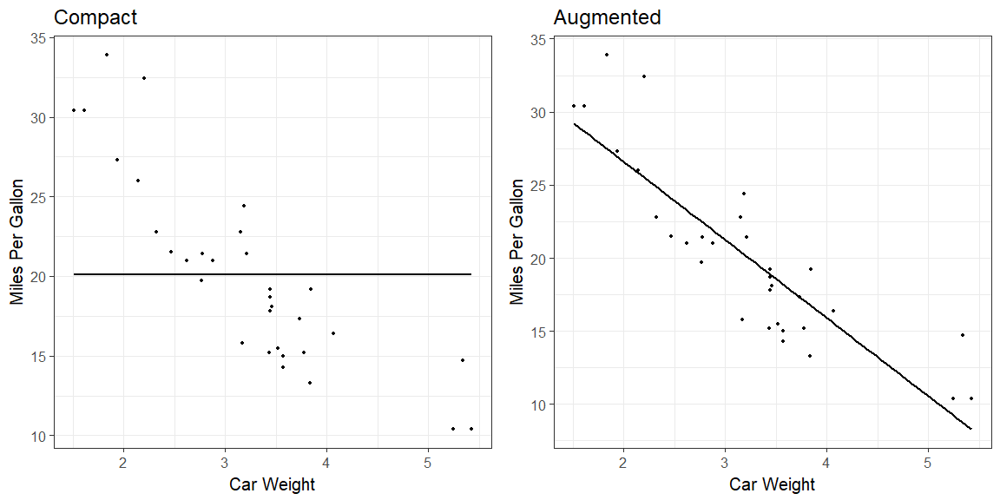
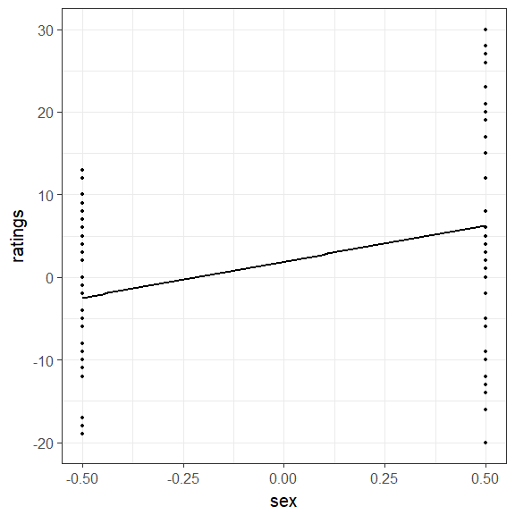

Model comparison approach to ANOVA
========================================================
author: Ivan Grahek
date: Ghent University (Belgium)
autosize: true
transition: none
width: 1600
height: 1000
css: css-file.css

Contents
========================================================
incremental: true
type: lineheight

- Model comparison approach to data analysis
- Regression 101 (2 continuous variables)
- Regression with categorical variables
- Model comparison approach to ANOVA


The standard way: IF-THEN cookbook
========================================================
incremental: true
type: lineheight

<div align = "center" style="float: bottom;">

</div>

The model comparison approach: Linear models all the way down
========================================================
incremental: true
type: lineheight

<div align = "center" style="float: bottom;">

</div>

The model comparison approach
========================================================
incremental: true
type: lineheight

- Most of the analyses can be viewed as comparisons of linear models
- t-test: two-level categorical variable as the predictor
- ANOVA: three-or-more-level categorical variable as the predictor
- Good introductions: 
    - Judd, McClelland, & Ryan (1989; 2017 - 3rd edition)
    - McElreath (2015)

What is a model?
========================================================
incremental: true
type: lineheight

<div align = "center" style="float: bottom;">

</div>

Compact description of data

Each of the cookbook procedures contains off-the-shelf models hidden inside

Here we will try to open these pasta machines 

Simple regression
========================================================
incremental: true
type: lineheight

What is a linear model?

$$
\begin{align}
\text{DATA} = \text{MODEL} + \text{ERROR} \\ 
\end{align}
$$

We will write this down as:

$$
\begin{align}

\mathcal y_{i} &\sim \mathrm{Normal}(\mu_{i},\sigma) \\
\mu_{i} &= \alpha + \beta_{1}x_{i} \\

\end{align}
$$

A lot of ways to write the same equation:

$$
\begin{align}

\mu_{i} &= \alpha + \beta_{1}x_{i} + \epsilon_{i} \\
\mathcal \epsilon_{i} &\sim \mathrm{Normal}(0,\sigma) \\

\end{align}
$$

Simple regression
========================================================
incremental: true
type: lineheight

How do we write this in R?

$$
\begin{align}

\mathcal y_{i} &\sim \mathrm{Normal}(\mu_{i},\sigma) \\
\mu_{i} &= \alpha + \beta_{1}x_{i} \\

\end{align}
$$


```r
model <- lm(y ~ 1 + x, data = d)
```

Simple regression
========================================================
incremental: true
type: lineheight

$$
\begin{align}
\mathcal y_{i} &\sim \mathrm{Normal}(\mu_{i},\sigma) \\
\mu_{i} &= \alpha + \beta_{1}x_{i} \\
\end{align}
$$

Our goal is always to estimate parameters:

$$
\begin{align}

\alpha\\
\beta_{1}\\
\sigma\\

\end{align}
$$

This is what we call "fitting a model to the data"

Let's get some data
========================================================
incremental: true
type: lineheight

Here is some fascinating data on properties of cars


```r
head (mtcars)
```

```
                   mpg cyl disp  hp drat    wt  qsec vs am gear carb
Mazda RX4         21.0   6  160 110 3.90 2.620 16.46  0  1    4    4
Mazda RX4 Wag     21.0   6  160 110 3.90 2.875 17.02  0  1    4    4
Datsun 710        22.8   4  108  93 3.85 2.320 18.61  1  1    4    1
Hornet 4 Drive    21.4   6  258 110 3.08 3.215 19.44  1  0    3    1
Hornet Sportabout 18.7   8  360 175 3.15 3.440 17.02  0  0    3    2
Valiant           18.1   6  225 105 2.76 3.460 20.22  1  0    3    1
```

Let's plot the data
========================================================
incremental: true
type: lineheight

A simple scatterplot


```r
# Basic scatter plot
ggplot(mtcars, aes(x=wt, y=mpg)) + 
  geom_point() + # Data points
  theme_bw(base_size = 20) # Theme
```


Fitting the simplest model 
========================================================
incremental: true
type: lineheight

$$
\begin{align}
\mathcal y_{i} &\sim \mathrm{Normal}(\mu_{i},\sigma) \\
\mu_{i} &= \alpha \\
\end{align}
$$


```r
# Basic scatter plot
ggplot(mtcars, aes(x=wt, y=mpg)) + 
  geom_point() + # Data points
  labs(x="Car Weight", y = "Miles Per Gallon") + # Name the axes
  theme_bw(base_size = 20) + # Theme for the plot
  geom_smooth(method = lm, se=FALSE, formula = y ~ 1, color = "black")  # Regression line
```


How bad is the model? 
========================================================
incremental: true
type: lineheight

These are our errors (sigma)


```r
model <- lm(mpg ~ 1, data = mtcars)
# Quick look at the actual, predicted, and residual values
library(tidyverse)
d = mtcars %>% 
    mutate(
      predicted = predict(model),   # Save the predicted values
      residuals = residuals(model) # Save the residual values  
 )%>%
  select(wt, mpg, predicted, residuals) 

sample_n(d, 10)
```

```
      wt  mpg predicted residuals
32 2.780 21.4  20.09062  1.309375
25 3.845 19.2  20.09062 -0.890625
11 3.440 17.8  20.09062 -2.290625
4  3.215 21.4  20.09062  1.309375
2  2.875 21.0  20.09062  0.909375
15 5.250 10.4  20.09062 -9.690625
17 5.345 14.7  20.09062 -5.390625
9  3.150 22.8  20.09062  2.709375
23 3.435 15.2  20.09062 -4.890625
24 3.840 13.3  20.09062 -6.790625
```
How bad is the model? 
========================================================
incremental: true
type: lineheight

Plot the residuals


What does our model think? 
========================================================
incremental: true
type: lineheight


```r
model <- lm(mpg ~ 1, data = mtcars)
summary(model)
```

```

Call:
lm(formula = mpg ~ 1, data = mtcars)

Residuals:
    Min      1Q  Median      3Q     Max 
-9.6906 -4.6656 -0.8906  2.7094 13.8094 

Coefficients:
            Estimate Std. Error t value Pr(>|t|)    
(Intercept)   20.091      1.065   18.86   <2e-16 ***
---
Signif. codes:  0 '***' 0.001 '**' 0.01 '*' 0.05 '.' 0.1 ' ' 1

Residual standard error: 6.027 on 31 degrees of freedom
```

Fitting the second simplest model
========================================================
incremental: true
type: lineheight

$$
\begin{align}
\mathcal y_{i} &\sim \mathrm{Normal}(\mu_{i},\sigma) \\
\mu_{i} &= \alpha + \beta_{1}x_{i} \\
\end{align}
$$


```r
# Basic scatter plot
ggplot(mtcars, aes(x=wt, y=mpg)) + 
  geom_point() + # Data points
  labs(x="Car Weight", y = "Miles Per Gallon") + # Name the axes
  theme_bw(base_size = 20) + # Theme for the plot
  geom_smooth(method = lm, se=FALSE, color = "black", formula = y ~ 1 + x) # Regression line
```


How bad is the model? 
========================================================
incremental: true
type: lineheight


```r
model <- lm(mpg ~ 1 + wt, data = mtcars)
# Quick look at the actual, predicted, and residual values
library(tidyverse)
d <- mtcars %>% 
    mutate(
      predicted = predict(model),   # Save the predicted values
      residuals = residuals(model) # Save the residual values  
 )%>%
  select(wt, mpg, predicted, residuals) 

sample_n(d, 10)
```

```
      wt  mpg predicted  residuals
19 1.615 30.4 28.653805  1.7461954
23 3.435 15.2 18.926866 -3.7268663
28 1.513 30.4 29.198941  1.2010593
5  3.440 18.7 18.900144 -0.2001440
2  2.875 21.0 21.919770 -0.9197704
7  3.570 14.3 18.205363 -3.9053627
24 3.840 13.3 16.762355 -3.4623553
20 1.835 33.9 27.478021  6.4219792
10 3.440 19.2 18.900144  0.2998560
17 5.345 14.7  8.718926  5.9810744
```
How bad is the model? 
========================================================
incremental: true
type: lineheight

Plot the residuals


What does our model think? 
========================================================
incremental: true
type: lineheight


```r
model <- lm(mpg ~ 1 + wt, data = mtcars)
  
summary(model)
```

```

Call:
lm(formula = mpg ~ 1 + wt, data = mtcars)

Residuals:
    Min      1Q  Median      3Q     Max 
-4.5432 -2.3647 -0.1252  1.4096  6.8727 

Coefficients:
            Estimate Std. Error t value Pr(>|t|)    
(Intercept)  37.2851     1.8776  19.858  < 2e-16 ***
wt           -5.3445     0.5591  -9.559 1.29e-10 ***
---
Signif. codes:  0 '***' 0.001 '**' 0.01 '*' 0.05 '.' 0.1 ' ' 1

Residual standard error: 3.046 on 30 degrees of freedom
Multiple R-squared:  0.7528,	Adjusted R-squared:  0.7446 
F-statistic: 91.38 on 1 and 30 DF,  p-value: 1.294e-10
```

How do we estimate the intercept and the slope? 
========================================================
incremental: true
type: lineheight

The goal is to find a set of parameters that minimize the residuals

Moving the line until we find the model with minimal errors


How do we estimate the intercept and the slope? 
========================================================
incremental: true
type: lineheight

We can quantify these errors as the Sum of Squared Errors (SSE) and pick the model with minimal SSE 


```r
model <- lm(mpg ~ 1 + wt, data = mtcars)
# Quick look at the actual, predicted, and residual values
library(tidyverse)
d <- mtcars %>% 
    mutate(
      predicted = predict(model),   # Save the predicted values
      residuals = residuals(model) # Save the residual values  
 )%>%
  select(wt, mpg, predicted, residuals) 

sample_n(d,10)
```

```
      wt  mpg predicted residuals
9  3.150 22.8  20.45004  2.349959
10 3.440 19.2  18.90014  0.299856
24 3.840 13.3  16.76236 -3.462355
32 2.780 21.4  22.42750 -1.027495
23 3.435 15.2  18.92687 -3.726866
29 3.170 15.8  20.34315 -4.543151
28 1.513 30.4  29.19894  1.201059
3  2.320 22.8  24.88595 -2.085952
14 3.780 15.2  17.08302 -1.883024
21 2.465 21.5  24.11100 -2.611004
```

```r
SSE <- sum(d$residuals^2) # Sum of squared errors
SSE
```

```
[1] 278.3219
```

Assumptions 
========================================================
incremental: true
type: lineheight

We create assumptions by our modelling choices!

$$
\begin{align}
\mathcal y_{i} &\sim \mathrm{Normal}(\mu_{i},\sigma) \\
\mu_{i} &= \alpha + \beta_{1}x_{i} \\
\end{align}
$$

Which assumptions do we make in this model?

- Normality of residuals

- Homogenity of variances

- Independence of the residuals
  - We shouldn't be able to predict residuals of an observation from other residuals 

Model fitting - summary 
========================================================
incremental: true
type: lineheight

$$
\begin{align}
\mathcal y_{i} &\sim \mathrm{Normal}(\mu_{i},\sigma) \\
\mu_{i} &= \alpha + \beta_{1}x_{i} \\
\end{align}
$$

1. We write down our model
2. We check that assumptions of our model are met
3. We estimate parameters so that errors are minimal

We usually fit multiple models and want to compare them

This is hypothesis testing (Model vs. Null)

Model comparison
========================================================
incremental: true
type: lineheight

How do we compare models?

Compact and augmented model



Model comparison
========================================================
incremental: true
type: lineheight

Let's calculate the SSEs of these two models


```r
Compact_model <- lm(mpg ~ 1, data = mtcars)
# Quick look at the actual, predicted, and residual values
library(tidyverse)
d_C <- mtcars %>% 
    mutate(
      predicted = predict(Compact_model),   # Save the predicted values
      residuals = residuals(Compact_model) # Save the residual values  
 )

SSE_Compact <- sum(d_C$residuals^2) # Sum of squared errors
SSE_Compact
```

```
[1] 1126.047
```


```r
Augmented_model <- lm(mpg ~ 1 + wt, data = mtcars)
# Quick look at the actual, predicted, and residual values
library(tidyverse)
d_A = mtcars %>% 
    mutate(
      predicted = predict(Augmented_model),   # Save the predicted values
      residuals = residuals(Augmented_model) # Save the residual values  
 )

SSE_Augmented <- sum(d_A$residuals^2) # Sum of squared errors
SSE_Augmented
```

```
[1] 278.3219
```

Model comparison
========================================================
incremental: true
type: lineheight

Proportional reduction in error 

How much (proportion) does the error reduce when we introduce an additional predictor?

$$
\begin{align}
\text{PRE} = \frac{\text{SSE_C} - \text{SSE_A}} {\text{SSE_C}} \\ 
\end{align}
$$


```r
PRE <- (SSE_Compact - SSE_Augmented)/SSE_Compact
PRE
```

```
[1] 0.7528328
```

Model comparison
========================================================
incremental: true
type: lineheight

F statistic

$$
\begin{align}
\text{F} = \frac{\text{PRE}/(\text{PA} - \text{PC})}{(1-\text{PRE})/(\text{n}-\text{PA})} \\ 
\end{align}
$$


```r
F_stat <- (PRE/(2-1))/((1-PRE)/(32-2))
F_stat
```

```
[1] 91.37533
```

```r
Compact_model <- lm(mpg ~ 1, data = mtcars)
Augmented_model <- lm(mpg ~ 1 + wt, data = mtcars)
anova(Compact_model,Augmented_model)
```

```
Analysis of Variance Table

Model 1: mpg ~ 1
Model 2: mpg ~ 1 + wt
  Res.Df     RSS Df Sum of Sq      F    Pr(>F)    
1     31 1126.05                                  
2     30  278.32  1    847.73 91.375 1.294e-10 ***
---
Signif. codes:  0 '***' 0.001 '**' 0.01 '*' 0.05 '.' 0.1 ' ' 1
```

Models with categorical predictors 
========================================================
incremental: true
type: lineheight

- Buliding a regression with a categorical predictor
- This is the case of a t-test

Let's get the data from the first lecture
========================================================
incremental: true
type: lineheight

Sex, drinks, and imagery


```r
d <- read.csv(file = "data_attitude.csv") # Get the data file if you are in the model_comparison_ANOVA WD
#d <- read.csv(file = "day_1_model_comparison_ANOVA/data_attitude.csv") # Get the data file if you are in the Bayes_UGent_2018 WD
head (d)
```

```
  participant    sex drink  imagery ratings
1           1 female  beer negative       6
2           2 female  beer negative      30
3           3 female  beer negative      15
4           4 female  beer negative      30
5           5 female  beer negative      12
6           6 female  beer negative      17
```

Let's plot the data
========================================================
incremental: true
type: lineheight

A simple scatterplot


```r
library(tidyverse)
ggplot(d, aes(x = sex, y = ratings)) +
    geom_point() + 
    theme_bw(base_size = 20)
```


Dummy coding
========================================================
incremental: true
type: lineheight

Our predictor is a categorical variable, how do we enter this is a regression?

We have to somehow turn them into numbers

Dummy coding: We have two categories, let males be zero!

For males:
$$
\begin{align}
\mathcal y_{i} &\sim \mathrm{Normal}(\mu_{i},\sigma) \\
\mu_{i} &= \alpha + \beta_{1}male \\ &= \alpha + 0 \\ &= \alpha
\end{align}
$$

For females:
$$
\begin{align}
\mathcal y_{i} &\sim \mathrm{Normal}(\mu_{i},\sigma) \\
\mu_{i} &= \alpha + \beta_{1}female \\  &= \alpha + \beta_{1}
\end{align}
$$

Dummy coding
========================================================
incremental: true
type: lineheight

How do we interpret the results?

Intercept will be the estimate of males, slope will be the difference between males and females


```r
model_dummy <- lm(ratings ~ sex, data = d)
summary(model_dummy)
```

```

Call:
lm(formula = ratings ~ sex, data = d)

Residuals:
    Min      1Q  Median      3Q     Max 
-26.275  -8.525  -0.775   9.725  23.725 

Coefficients:
            Estimate Std. Error t value Pr(>|t|)   
(Intercept)    6.275      1.949   3.220  0.00187 **
sexmale       -8.750      2.756  -3.175  0.00215 **
---
Signif. codes:  0 '***' 0.001 '**' 0.01 '*' 0.05 '.' 0.1 ' ' 1

Residual standard error: 12.33 on 78 degrees of freedom
Multiple R-squared:  0.1144,	Adjusted R-squared:  0.1031 
F-statistic: 10.08 on 1 and 78 DF,  p-value: 0.002147
```

Contrast coding
========================================================
incremental: true
type: lineheight

The values of contrast variables across the two categories sum to zero

Males = -0.5; Females = +0.5


    
Contrast coding
========================================================
incremental: true
type: lineheight

How do the equations look like?

For males:

$$
\begin{align}
\mathcal y_{i} &\sim \mathrm{Normal}(\mu_{i},\sigma) \\
\mu_{male} &= \alpha + \beta_{1} \times (-0.5) \\ &= \alpha - \beta_{1}/2
\end{align}
$$

For females:

$$
\begin{align}
\mathcal y_{i} &\sim \mathrm{Normal}(\mu_{i},\sigma) \\
\mu_{female} &= \alpha + \beta_{1} \times (+0.5) \\ &= \alpha + \beta_{1}/2
\end{align}
$$

Contrast coding
========================================================
incremental: true
type: lineheight

How do we interpret the results?

Intercept is the average of the two group means

Slope is the difference between the two means (different if codes are -1 and 1, but same F statistic)


```r
model_contrast <- lm(ratings ~ sex, data = d_contrast)
summary(model_contrast)
```

```

Call:
lm(formula = ratings ~ sex, data = d_contrast)

Residuals:
    Min      1Q  Median      3Q     Max 
-26.275  -8.525  -0.775   9.725  23.725 

Coefficients:
            Estimate Std. Error t value Pr(>|t|)   
(Intercept)    1.900      1.378   1.379  0.17191   
sex            8.750      2.756   3.175  0.00215 **
---
Signif. codes:  0 '***' 0.001 '**' 0.01 '*' 0.05 '.' 0.1 ' ' 1

Residual standard error: 12.33 on 78 degrees of freedom
Multiple R-squared:  0.1144,	Adjusted R-squared:  0.1031 
F-statistic: 10.08 on 1 and 78 DF,  p-value: 0.002147
```

Full ANOVA 
========================================================
incremental: true
type: lineheight

Which models are contained in a 2X2 ANOVA?

$$
\begin{align}

\mathcal{Null} : \text{ratings}_{i} &\sim \mathrm{Normal}(\mu_{i},\sigma) \\
\mu_{i} &= \alpha \\
\\
\mathcal{Drink} : \text{ratings}_{i} &\sim \mathrm{Normal}(\mu_{i},\sigma) \\
\mu_{i} &= \alpha + \beta_{1} \text{drink}_{i} \\
\\
\mathcal{Imagery} : \text{ratings}_{i} &\sim \mathrm{Normal}(\mu_{i},\sigma) \\
\mu_{i} &= \alpha + \beta_{1} \text{imagery}_{i} \\
\\
\mathcal{Main effects} : \text{ratings}_{i} &\sim \mathrm{Normal}(\mu_{i},\sigma) \\
\mu_{i} &= \alpha + \beta_{1} \text{drink}_{i} + \beta_{2} \text{imagery}_{i}  \\
\\
\mathcal{Interactions} : \text{ratings}_{i} &\sim \mathrm{Normal}(\mu_{i},\sigma) \\
\mu_{i} &= \alpha + \beta_{1} \text{drink}_{i} + \beta_{2} \text{imagery}_{i} + \beta_{3} \text{drink}_{i} \times \text{imagery}_{i} \\

\end{align}
$$

Full ANOVA in lm
========================================================
incremental: true
type: lineheight

How do we write this in R?


```r
model_null <- lm(ratings ~ 1, data = d)
model_drink <- lm(ratings ~ drink, data = d)
model_imagery <- lm(ratings ~ imagery, data = d)
model_maineffects <- lm(ratings ~ drink + imagery, data = d)
model_interaction <- lm(ratings ~ drink * imagery, data = d)
```

Exercise 
========================================================
incremental: true
type: lineheight

1. Import the exercise data (2X2 water and imagery)

2. Change the data set so that every row is a new participant

3. Contrast code both drink and imagery

4. Fit all of the ANOVA models and check which one has the lowest R squared 

5. Calculate PRE and F statistic comparing the interaction and the two main effects model

Solution 
========================================================
incremental: true
type: lineheight

Contrast coding


```r
library(tidyverse)
d_contrast <- d %>% 
    mutate(
      drink = ifelse(d$drink == "beer", -0.5, 0.5),   # Contrast coding
      imagery = ifelse(d$imagery == "neutral", -0.5, 0.5),   # Contrast coding
      participant = c(1:length(d$participant))  # Change the participant number
            ) 
```

All the ANOVA models


```r
model_null <- lm(ratings ~ 1, data = d_contrast)
model_drink <- lm(ratings ~ drink, data = d_contrast)
model_imagery <- lm(ratings ~ imagery, data = d_contrast)
model_maineffects <- lm(ratings ~ drink + imagery, data = d_contrast)
model_interaction <- lm(ratings ~ drink * imagery, data = d_contrast)
```

Solution - Model comparison
========================================================
incremental: true
type: lineheight

Compare the models with ANOVA


```r
anova(model_null, model_interaction)
```

```
Analysis of Variance Table

Model 1: ratings ~ 1
Model 2: ratings ~ drink * imagery
  Res.Df     RSS Df Sum of Sq     F    Pr(>F)    
1     79 13381.2                                 
2     76  9470.7  3    3910.5 10.46 7.728e-06 ***
---
Signif. codes:  0 '***' 0.001 '**' 0.01 '*' 0.05 '.' 0.1 ' ' 1
```

Solution - Model comparison
========================================================
incremental: true
type: lineheight

Let's calculate the SSEs of these two models


```r
model_maineffects <- lm(ratings ~ drink + imagery, data = d_contrast)
# Quick look at the actual, predicted, and residual values
library(tidyverse)
d_main = d_contrast %>% 
    mutate(
      predicted = predict(model_maineffects),   # Save the predicted values
      residuals = residuals(model_maineffects) # Save the residual values  
 )

SSE_Main <- sum(d_main$residuals^2) # Sum of squared errors
SSE_Main
```

```
[1] 9650.7
```


```r
model_interaction <- lm(ratings ~ drink * imagery, data = d_contrast)
# Quick look at the actual, predicted, and residual values
library(tidyverse)
d_interaction <- d_contrast %>% 
    mutate(
      predicted = predict(model_interaction),   # Save the predicted values
      residuals = residuals(model_interaction) # Save the residual values  
 )

SSE_Interaction <- sum(d_interaction$residuals^2) # Sum of squared errors
SSE_Interaction
```

```
[1] 9470.7
```

Solution - Model comparison
========================================================
incremental: true
type: lineheight

Proportional reduction in error 

How much (proportion) does the error reduce when we introduce an additional predictor?

$$
\begin{align}
\text{PRE} = \frac{\text{SSE_C} - \text{SSE_A}} {\text{SSE_C}} \\ 
\end{align}
$$


```r
PRE <- (SSE_Main - SSE_Interaction)/SSE_Main
PRE
```

```
[1] 0.0186515
```

Solution - Model comparison
========================================================
incremental: true
type: lineheight

F statistic

$$
\begin{align}
\text{F} = \frac{\text{PRE}/(\text{PA} - \text{PC})}{(1-\text{PRE})/(\text{n}-\text{PA})} \\ 
\end{align}
$$


```r
F_stat <- (PRE/(4-3))/((1-PRE)/(80-4))
F_stat
```

```
[1] 1.444455
```

Solution - Model comparison
========================================================
incremental: true
type: lineheight

Is this the same as what we got earlier?


```r
anova(model_maineffects,model_interaction)
```

```
Analysis of Variance Table

Model 1: ratings ~ drink + imagery
Model 2: ratings ~ drink * imagery
  Res.Df    RSS Df Sum of Sq      F Pr(>F)
1     77 9650.7                           
2     76 9470.7  1       180 1.4445 0.2332
```

```r
library(afex)
library(multcomp) # we didn't explicitly install this package, but it's part of the dependencies of 'afex'
rmANOVA.att <- aov_ez("participant",                     # variable with subject identifier
                      "ratings",                         # dependent variable
                      d_contrast, # data frame
                      between = c("drink", "imagery"),    # between-subject variables
                      type = 3)                          # type-III sums of squares (default in SPSS)
rmANOVA.att
```

```
Anova Table (Type 3 tests)

Response: ratings
         Effect    df    MSE         F ges p.value
1         drink 1, 76 124.61 18.20 *** .19  <.0001
2       imagery 1, 76 124.61 11.73 *** .13   .0010
3 drink:imagery 1, 76 124.61      1.44 .02     .23
---
Signif. codes:  0 '***' 0.001 '**' 0.01 '*' 0.05 '+' 0.1 ' ' 1
```

RM ANOVA
========================================================
incremental: true
type: lineheight

Remember one of the assumptions: Independence of the residuals

We have to eliminate the within-subject variance

Make a composite score - one for each subject


```r
library(tidyverse)
library(reshape2)

data.diff = d %>% dcast(participant ~ drink + imagery,
                  value.var = "ratings")

data.diff$diff = (data.diff$beer_negative - data.diff$beer_neutral) - (data.diff$water_negative - data.diff$water_neutral)

model_null_RM <- lm(diff ~ 0, data = data.diff)
model_interaction_RM <- lm(diff ~ 1, data = data.diff)

anova(model_null_RM,model_interaction_RM)
```

```
Analysis of Variance Table

Model 1: diff ~ 0
Model 2: diff ~ 1
  Res.Df  RSS Df Sum of Sq      F  Pr(>F)  
1     20 2746                              
2     19 2026  1       720 6.7522 0.01764 *
---
Signif. codes:  0 '***' 0.001 '**' 0.01 '*' 0.05 '.' 0.1 ' ' 1
```

Summary
========================================================
incremental: true
type: lineheight

1. When testing hypotheses we are always comparing models

2. We first fit the models and then we compare them

3. All of the usual tests can be thought of as linear models

4. We need to be aware of what is in our pasta machines

The End
========================================================
incremental: false
type: lineheight

Thank you for your attention!

e-mail: ivan.grahek@ugent.be


<script src="https://ajax.googleapis.com/ajax/libs/jquery/3.1.1/jquery.min.js"></script>
<script>

for(i=0;i<$("section").length;i++) {
if(i==0) continue
$("section").eq(i).append("<p style='font-size:xx-large;position:fixed;right:30px;bottom:30px;'>" + i + "</p>")
}

</script>
